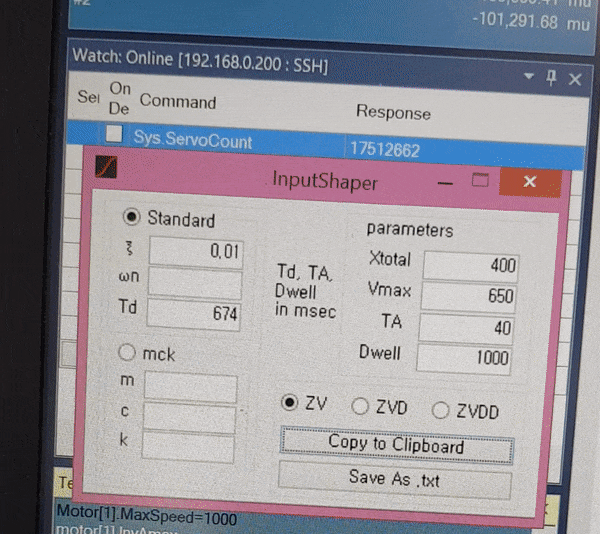

# WinForms
Windows Forms projects written in C# or Visual Basic

## Input Shaping PMAC Code Generator
One-touch PMAC source code generator for input shaping from the coefficients.
- Input Shaping: Notice the reduced vibration of the mass on the top.

    
    

## Unpack and Extract

    

### a Table Scheduler (no source code)

    

### Weekly Scheduler (no source code)

    

